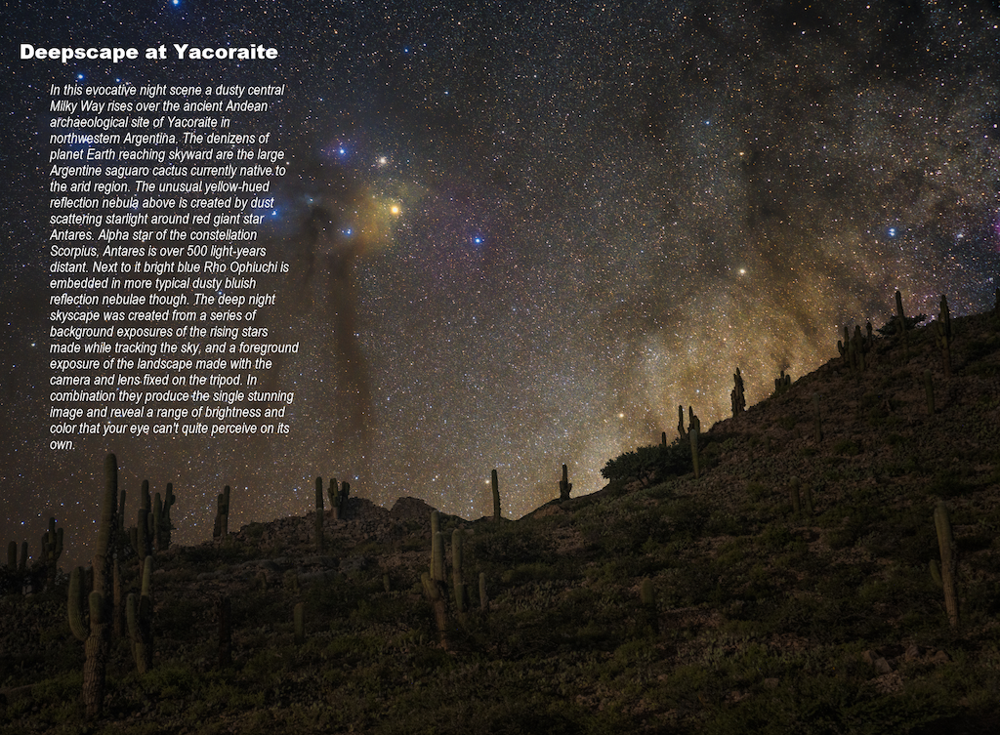
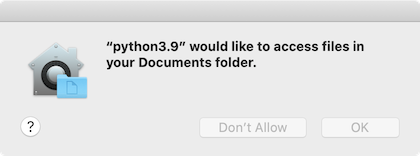
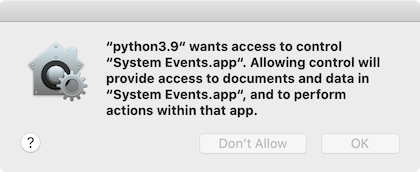
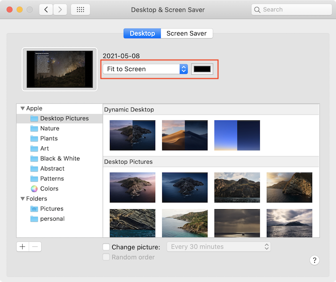

apod-grabber
============
Sets your Mac's desktop to the current [NASA Astronomy Photo of the Day](https://apod.nasa.gov/apod/), including explanation text overlaid onto image.

# Usage:
- Manual
  - `python3 apodgrab.py`
- Automated
  - See 'Installation' below

# Requirements:
 - Homebrew ( see install instructions at https://brew.sh/ )
 - Python 3 ( brew install python3 )
 - BeautifulSoup ( pip3 install beautifulsoup4 )
 - Pillow ( pip3 install pillow )

# Installation:
 1. `cp dependencies/com.krishengreenwell.apod.plist ~/Library/LaunchAgents`
 3. `vi ~/Library/LaunchAgents/com.krishengreenwell.apod.plist`
 4. Change line 8 to the absolute path to your `apod-grabber` GitHub checkout
 5. Change line 11 to the absolute path to your `python3` installation (to find this, run `which python3`)
 6. `launchctl load ~/Library/LaunchAgents/com.krishengreenwell.apod.plist`
 7. `launchctl start com.krishengreenwell.apod`
 8. Grant the following two permissions ('Documents' may vary based on the location of your `apod-grabber` checkout):
    - 
    - 
 9. Go to System Preferences > Desktop and select `Fit to Screen` and black background color:
    - 

# Notes:
 - Very much a work in progress! Please be patient/forgiving. If something doesn't look right, please [browse the existing issues](https://github.com/asterizk/apod-grabber/issues) or [file a new one](https://github.com/asterizk/apod-grabber/issues/new)
 - Captioned APOD images are archived at `~/Pictures/apod/`
 
# TODO:
 - Create a lighter region under textbox to make it more readable in event of a busy background
 - Perhaps choose a more permanent place than the temp directory to store the images -- seems I lost some after a few days
 - Get rid of apodosa.sh if possible
 - Decide install location in order to get rid of home directory dependency in `dependencies/com.krishengreenwell.apod.plist`
 - Create installer

# Feature ideas:
 - Option to turn off captions
 - Make archiving of captioned APOD images a preference

# Credits
 - Inspired by Harold Bakker's "Astronomy Picture Of the Day to Desktop" utility -- http://www.haroldbakker.com/personal/apod.php
