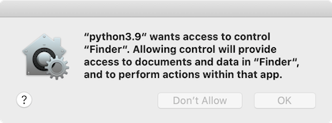

apod-grabber
============
Sets the Mac desktop to the current [NASA Astronomy Photo of the Day](https://apod.nasa.gov/apod/), including explanation text overlaid onto image.

# Usage:
- Manual
  - `python3 apodgrab.py`
- Automated
  - See 'Installation' below

# Requirements:
 - Homebrew ( see install instructions at https://brew.sh/ )
 - Python 3 ( brew install python3 )
 - BeautifulSoup ( pip3 install beautifulsoup4 )
 - Pillow ( pip3 install pillow )

# Installation:
 1. Copy `dependencies/com.krishengreenwell.apod.plist` to `~/Library/LaunchAgents/`
 2. Open `~/Library/LaunchAgents/com.krishengreenwell.apod.plist` in your favorite text editor
 3. Change line 8 to the absolute path of your `apod-grabber` GitHub checkout and save the file
 4. In Terminal:
    - `launchctl load ~/Library/LaunchAgents/com.krishengreenwell.apod.plist`
    - `launchctl start com.krishengreenwell.apod`
 5. Grant the following two permissions ('Documents' may vary based on the location of your `apod-grabber` checkout):
    - 
    - 
 6. Go to System Preferences > Desktop and select `Fit to Screen` and black background color:
    - 

# Notes:
 - Captioned APOD images can be found at `$TMPDIR/apod/`
 - Very much a work in progress! Please be patient/forgiving. If something doesn't look right, please [browse the existing issues](https://github.com/asterizk/apod-grabber/issues) or [file a new one](https://github.com/asterizk/apod-grabber/issues/new)
 
# TODO:
 - Get rid of apodosa.sh if possible
 - Decide install location in order to get rid of home directory dependency in `dependencies/com.krishengreenwell.apod.plist`
 - Create installer

# Feature ideas:
 - Option to turn off captions
